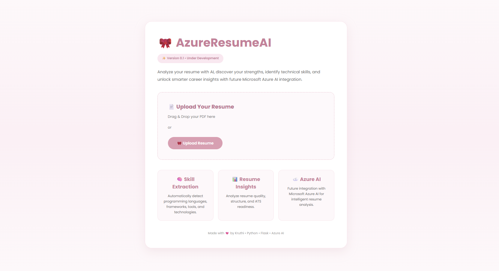

# AzureResumeAI
An AI-powered resume analyzer built with Python, Flask, and Microsoft Azure AI Services.
The goal is to help users upload their resumes, extract useful information, and eventually provide AI-powered feedback using Microsoft Azure AI Services.

Why I'm Building This?
I'm learning Azure and wanted to build a project that solves a real problem instead of following a basic tutorial. I'll keep improving this project as I learn more.
This project is actively being developed.

Here's My Project Under Construction  🚧 

